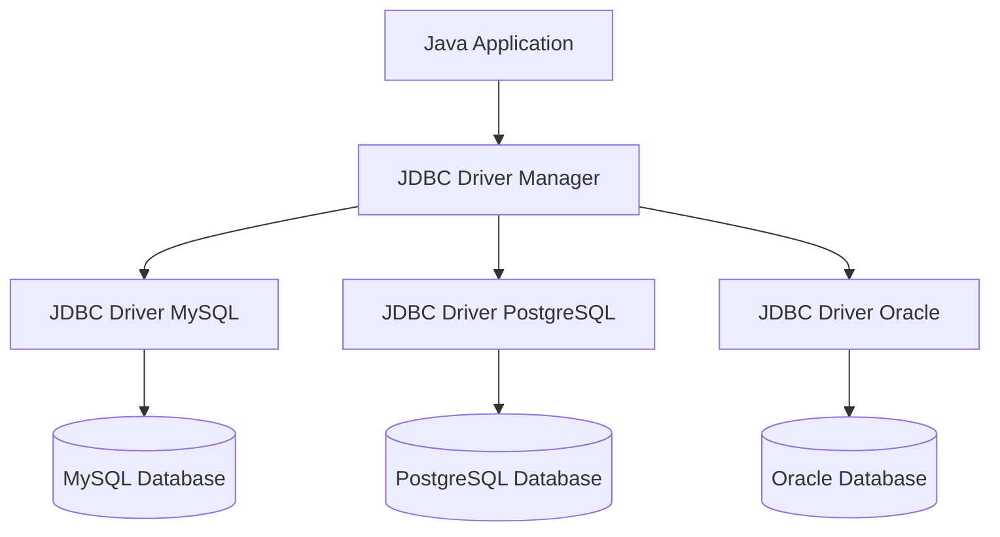
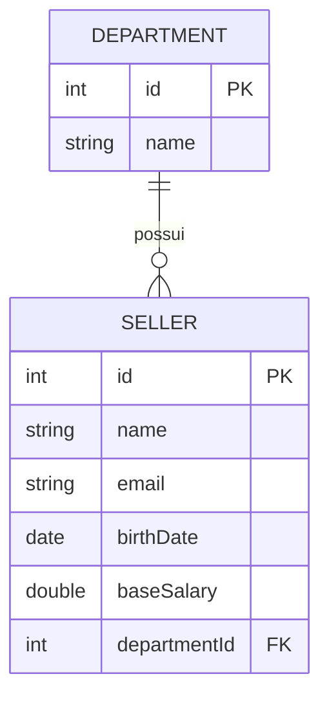
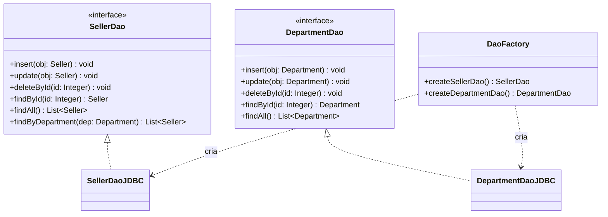

# Demo DAO JDBC — Acesso a Dados com JDBC

# Sobre o projeto

Este projeto é um estudo prático de **acesso a banco de dados em Java utilizando JDBC puro** (sem frameworks de ORM). O objetivo é implementar manualmente o **padrão de projeto DAO (Data Access Object)**, entendendo como funciona por baixo dos panos o que frameworks como o JPA/Hibernate automatizam.

O domínio da aplicação é simples: **Departamentos (`Department`)** e **Vendedores (`Seller`)**, onde cada vendedor pertence a um departamento.

Projeto desenvolvido com base no curso **Programação Orientada a Objetos com Java**, do Prof. Dr. Nelio Alves ([educandoweb.com.br](http://educandoweb.com.br)).

# Tecnologias utilizadas

- Java
- JDBC (`java.sql`)
- MySQL Server + MySQL Workbench
- MySQL Connector/J (driver JDBC)
- Eclipse IDE
- Git / GitHub

# Arquitetura do projeto

O projeto segue a arquitetura clássica de acesso a dados com o padrão DAO, sem nenhum framework de persistência:

```
application (Program / Progam2)
        │
        ▼
  model.dao (interfaces)      ← SellerDao, DepartmentDao
        │
        ▼
model.dao.impl (implementação)← SellerDaoJDBC, DepartmentDaoJDBC
        │
        ▼
       db                     ← DB (gerencia Connection), DbException, DbIntegrityException
        │
        ▼
   MySQL Database             ← banco "coursejdbc"
```

Cada camada só conhece a camada imediatamente abaixo. As classes de aplicação (`Program`, `Progam2`) só enxergam as **interfaces** DAO — a implementação concreta (JDBC) é escondida atrás da `DaoFactory`, o que permite trocar a tecnologia de persistência no futuro sem alterar o código cliente.

# Visão geral do JDBC

O JDBC (*Java Database Connectivity*) é a API padrão do Java para acesso a dados, composta pelos pacotes `java.sql` e `javax.sql`. Ele funciona através de um **Driver Manager**, que roteia as chamadas da aplicação para o driver específico do banco de dados em uso:



Nesse projeto, o driver utilizado é o **MySQL Connector/J**.

# Modelo de dados

## Diagrama de entidades



Um `Department` pode ter vários `Seller`, mas cada `Seller` pertence a exatamente um `Department` (relação 1:N).

## Department

| Campo | Tipo | Descrição |
|---|---|---|
| id | Integer | PK |
| name | String | Nome do departamento |

## Seller

| Campo | Tipo | Descrição |
|---|---|---|
| id | Integer | PK |
| name | String | Nome do vendedor |
| email | String | E-mail |
| birthDate | Date | Data de nascimento |
| baseSalary | Double | Salário base |
| department | Department | Departamento do vendedor (FK `DepartmentId`) |

Ambas as entidades implementam `Serializable`, possuem construtor vazio e completo, getters/setters, e sobrescrevem `hashCode`, `equals` (baseados no `id`) e `toString`.

# Padrão de projeto DAO (Data Access Object)

**Ideia geral:** para cada entidade existe um objeto responsável por seu acesso a dados. Esse objeto é definido por uma **interface**, e sua implementação concreta fica isolada em um pacote separado (`impl`). A criação das instâncias é feita por uma **Factory** (`DaoFactory`), centralizando a injeção de dependência.



Como as interfaces (`SellerDao`, `DepartmentDao`) não fazem nenhuma referência a JDBC, seria possível no futuro criar uma implementação alternativa (por exemplo, `SellerDaoJPA`) sem alterar o restante da aplicação.

# Estrutura de pastas

```
demo-dao-jdbc
├── db.properties
└── src
    ├── application
    │   ├── Program.java        → testes de CRUD do Seller
    │   └── Progam2.java        → testes de CRUD do Department
    ├── db
    │   ├── DB.java                  → gerencia Connection, Statement e ResultSet
    │   ├── DbException.java         → exceção genérica de banco
    │   └── DbIntegrityException.java→ exceção de violação de integridade referencial
    └── model
        ├── dao
        │   ├── DepartmentDao.java   → interface
        │   ├── SellerDao.java       → interface
        │   ├── DaoFactory.java      → fábrica de DAOs
        │   └── impl
        │       ├── DepartmentDaoJDBC.java
        │       └── SellerDaoJDBC.java
        └── entities
            ├── Department.java
            └── Seller.java
```

# Configuração do banco de dados

## 1. Instalar as ferramentas

- Instalar o **MySQL Server**
- Instalar o **MySQL Workbench**

## 2. Criar o banco de dados

Usando o MySQL Workbench, crie um banco chamado `coursejdbc` com as tabelas `department` e `seller`:

```sql
CREATE DATABASE IF NOT EXISTS coursejdbc;
USE coursejdbc;

CREATE TABLE department (
    Id INT AUTO_INCREMENT PRIMARY KEY,
    Name VARCHAR(60) NOT NULL
);

CREATE TABLE seller (
    Id INT AUTO_INCREMENT PRIMARY KEY,
    Name VARCHAR(60) NOT NULL,
    Email VARCHAR(100) NOT NULL,
    BirthDate DATE NOT NULL,
    BaseSalary DOUBLE NOT NULL,
    DepartmentId INT NOT NULL,
    FOREIGN KEY (DepartmentId) REFERENCES department (Id)
);

INSERT INTO department (Name) VALUES
    ('Computers'), ('Electronics'), ('Fashion'), ('Books');

INSERT INTO seller (Name, Email, BirthDate, BaseSalary, DepartmentId) VALUES
    ('Bob Brown', 'bob@gmail.com', '1998-04-21', 1000.00, 1),
    ('Maria Green', 'maria@gmail.com', '1979-12-31', 3500.00, 2),
    ('Alex Grey', 'alex@gmail.com', '1988-01-15', 2200.00, 1),
    ('Martha Red', 'martha@gmail.com', '1993-11-30', 3000.00, 4),
    ('Donald Blue', 'donald@gmail.com', '2000-01-09', 4000.00, 3),
    ('Alex Pink', 'bob@gmail.com', '1997-03-04', 3090.00, 2);
```

> Ajuste os dados de exemplo conforme sua necessidade — o essencial é ter as tabelas `department` e `seller` com essas colunas, já que os DAOs fazem referência direta a elas (`Id`, `Name`, `Email`, `BirthDate`, `BaseSalary`, `DepartmentId`).

## 3. Configurar o driver JDBC (MySQL Connector/J)

- Baixar o **MySQL Java Connector**
- No Eclipse: `Window → Preferences → Java → Build Path → User Libraries`
- Criar uma User Library chamada `MySQLConnector` e adicionar o `.jar` do driver
- Adicionar essa User Library ao projeto

## 4. Configurar a conexão

Na raiz do projeto já existe o arquivo `db.properties`. Ajuste usuário, senha e URL conforme seu ambiente:

```properties
user=developer
password=123456789
dburl=jdbc:mysql://localhost:3306/coursejdbc
useSSL=false
```

# Como executar o projeto

1. Clone o repositório:

```bash
git clone https://github.com/guilhermenoe2020-netizen/demo-dao-jdbc.git
cd demo-dao-jdbc
```

2. Importe o projeto no Eclipse como **Existing Java Project**.
3. Garanta que a User Library `MySQLConnector` está associada ao projeto (veja seção anterior).
4. Confira o `db.properties` e certifique-se de que o MySQL está rodando com o banco `coursejdbc` criado.
5. Execute uma das classes de teste:
   - `application/Program.java` → testa o CRUD completo de `Seller`
   - `application/Progam2.java` → testa o CRUD completo de `Department`

# Funcionalidades implementadas

## `SellerDao`

| Método | Descrição |
|---|---|
| `insert(Seller obj)` | Insere um vendedor e recupera o ID gerado pelo banco |
| `update(Seller obj)` | Atualiza todos os dados de um vendedor existente |
| `deleteById(Integer id)` | Remove um vendedor pelo ID |
| `findById(Integer id)` | Busca um vendedor por ID, já trazendo o departamento associado (`INNER JOIN`) |
| `findAll()` | Lista todos os vendedores com seus departamentos, ordenados por nome |
| `findByDepartment(Department dep)` | Lista os vendedores de um departamento específico |

## `DepartmentDao`

| Método | Descrição |
|---|---|
| `insert(Department obj)` | Insere um departamento e recupera o ID gerado |
| `update(Department obj)` | Atualiza o nome de um departamento |
| `deleteById(Integer id)` | Remove um departamento pelo ID |
| `findById(Integer id)` | Busca um departamento por ID |
| `findAll()` | Lista todos os departamentos ordenados por nome |

# Tratamento de exceções

| Exceção | Quando é lançada |
|---|---|
| `DbException` | Erro genérico de acesso ao banco (falha de conexão, erro de SQL, etc.) |
| `DbIntegrityException` | Violação de integridade referencial (ex.: tentar deletar um departamento que possui vendedores vinculados) |

Ambas estendem `RuntimeException`, evitando a obrigatoriedade de `try/catch` em todo lugar onde os DAOs são utilizados.

# Conceitos importantes aplicados

- **`PreparedStatement`** — evita SQL Injection e permite reutilização do plano de execução da query.
- **`Statement.RETURN_GENERATED_KEYS` + `getGeneratedKeys()`** — recupera o ID gerado automaticamente pelo banco após um `INSERT`.
- **`INNER JOIN` na busca de `Seller`** — cada vendedor já retorna acompanhado dos dados do seu departamento em uma única consulta.
- **Reaproveitamento de instâncias com `Map`** — em `findAll()` e `findByDepartment()`, um `Map<Integer, Department>` garante que vendedores do mesmo departamento compartilhem a **mesma instância** de `Department` em memória, evitando objetos duplicados (ver seção "Modelo de dados").
- **`try / catch / finally`** — todo acesso ao banco fecha `Statement` e `ResultSet` no `finally`, através dos métodos auxiliares estáticos da classe `DB`.
- **Conexão única reaproveitada (`DB.getConnection()`)** — a classe `DB` mantém uma única `Connection` estática, aberta sob demanda e reaproveitada nas chamadas seguintes.
- **DAO Factory** — a classe `DaoFactory` isola a criação das implementações concretas (`SellerDaoJDBC`, `DepartmentDaoJDBC`), fazendo com que o restante da aplicação dependa apenas das interfaces.

# Testes manuais (`application`)

- **`Program.java`** — exercita o CRUD completo de `Seller`: busca por ID, busca por departamento, lista todos, insere, atualiza e deleta (pedindo o ID via `Scanner`).
- **`Progam2.java`** — exercita o CRUD completo de `Department`: busca por ID, lista todos, insere, atualiza e deleta (pedindo o ID via `Scanner`).

> Ambas as classes imprimem os resultados no console a cada etapa, servindo como roteiro de verificação manual do funcionamento dos DAOs.

# Referências

- Curso: [Programação Orientada a Objetos com Java](http://educandoweb.com.br) — Prof. Dr. Nelio Alves
- [DAO Pattern - DevMedia](https://www.devmedia.com.br/dao-pattern-persistencia-de-dados-utilizando-o-padrao-dao/30999)
- [Data Access Object - Oracle](https://www.oracle.com/technetwork/java/dataaccessobject-138824.html)
- [Documentação oficial do JDBC](https://docs.oracle.com/javase/8/docs/technotes/guides/jdbc/)

# Autor

Guilherme Noé
